# Audio Contact Attribute Analysis Service

A production-style Python 3.11/FastAPI service that analyzes a short inbound logistics-call audio sample and returns conservative estimates of:

- gender presentation: `male`, `female`, or `unknown`
- age bracket: `18-30`, `31-45`, `46-60`, `60+`, or `unknown`
- heuristic confidence for each attribute
- audio quality: `good`, `degraded`, or `insufficient`
- end-to-end processing time

The service is uncertainty-aware. Silence, short speech, clipping, low volume, noise, mixed voices, or weak model evidence result in `unknown` instead of an unreliable categorical answer. Caller audio is processed locally in memory and is never sent to an external inference API.

> **License notice:** the required `audeering/wav2vec2-large-robust-6-ft-age-gender` checkpoint is licensed under CC BY-NC-SA 4.0. Commercial use requires a separate legal and licensing review.

## Features

- Multipart-only `POST /analyze` endpoint with UUID validation and bounded streaming upload parsing
- WAV/PCM, MP3, WebM/Opus, OGG/Opus, M4A/AAC, and other self-describing formats supported by FFmpeg
- Direct in-memory decoding for already-normalized mono 16 kHz PCM16 or float32 WAV
- FFmpeg stdin/stdout normalization for all other supported inputs
- Silero VAD with speech duration, ratio, segment merging, and inference-input extraction
- Signal-quality checks for RMS, peak, clipping, silence, and approximate SNR
- audEERING six-layer Wav2Vec2 age/gender inference
- Conservative confidence thresholds, gender-class margin, and age-boundary rejection
- FastAPI lifespan initialization, warm-up, readiness state, and graceful startup failure
- Bounded inference concurrency without blocking the event loop
- JSON logs, request IDs, stage timings, and Prometheus metrics
- Unit, API, FFmpeg integration, and opt-in real-model tests
- Non-root Docker image with persistent model and optional Inductor caches

## Scope and non-goals

Version 1 implements buffered REST analysis only. It does not implement streaming, WebSockets, progressive predictions, transcription, language or accent detection, speaker identity, evaluation datasets, or speaker diarization. It estimates vocal presentation rather than identity, legal sex, actual gender identity, or exact age. Results should be treated as low-stakes routing hints and must not be the sole basis for consequential decisions.

## Architecture

```mermaid
flowchart LR
    Client[Telephony adapter] --> API[FastAPI /analyze]
    API --> Parser[Bounded in-memory multipart parser]
    Parser --> Decode{Normalized WAV?}
    Decode -- Mono 16 kHz PCM16/float32 --> Direct[Direct RIFF decode]
    Decode -- Other self-describing audio --> FFmpeg[FFmpeg normalize]
    Direct --> Validate[Waveform validation]
    FFmpeg --> Validate
    Validate --> VAD[Silero VAD]
    VAD --> Quality[Quality analysis]
    Quality --> Gate{Sufficient speech?}
    Gate -- No --> Unknown[Unknown / insufficient]
    Gate -- Yes --> Worker[Bounded inference worker]
    Worker --> Model[6-layer Wav2Vec2]
    Model --> Policy[Age and gender policy]
    Policy --> Response[Typed JSON]
    Unknown --> Response
    API -. logs and timings .-> Observe[Prometheus + JSON logs]
```



FastAPI lifespan loads and warms FFmpeg availability, Silero VAD, and the audEERING model once. Readiness is set only after all required components succeed. One Uvicorn worker is used by default because each process would otherwise load another large model. CPU-heavy work runs outside the event loop, and model inference is protected by a bounded executor and semaphore.

## Processing flow

1. Accept exactly one `contact_id` field and one `audio` part.
2. Validate the multipart boundary, UUID, field count, and byte limits while reading the request.
3. Parse normalized WAV directly or normalize other self-describing audio through FFmpeg to mono 16 kHz float32 PCM.
4. Validate that the waveform is non-empty, finite, within the configured duration, and has a valid amplitude.
5. Run Silero VAD and calculate total duration, speech duration, and speech ratio.
6. Preserve pauses up to 250 ms and join larger speech blocks with a short neutral separator. Limit inference input to five seconds.
7. Calculate RMS, peak, clipping ratio, silence ratio, and an approximate speech/non-speech RMS SNR.
8. Return `insufficient` and skip inference when speech or signal quality is unusable.
9. Otherwise run Wav2Vec2 under `model.eval()` and `torch.inference_mode()`.
10. Apply confidence, quality, margin, and age-boundary policies; emit operational telemetry and clear mutable request buffers.

The SNR calculation is an explainable approximation, not a laboratory measurement. Noise overlapping speech may not be fully represented by the non-speech reference frames.

## Design decisions and model rationale

The audEERING `wav2vec2-large-robust-6-ft-age-gender` checkpoint was selected because it directly provides normalized age and `female`/`male`/`child` outputs while using six fine-tuned transformer layers rather than the larger 24-layer alternative. This makes it a reasonable CPU-oriented assignment baseline. The local model class mirrors the published head, loads safetensors without remote executable code, and interprets the checkpoint tensor order as `female`, `male`, `child`. Normalized age is converted to approximate years internally but only a bracket is exposed.

Silero VAD prevents silence and long non-speech regions from reaching the attribute model. FFmpeg handles compressed and telephony containers, while a strict RIFF parser bypasses subprocess startup for mono 16 kHz PCM16/float32 WAV. NumPy and librosa provide transparent signal measurements. Confidence is deliberately conservative: poor quality reduces confidence, close gender classes and age-boundary estimates become `unknown`, and insufficient audio skips inference entirely. These scores are assignment-level heuristics, not calibrated probabilities.

With more time, the service should be calibrated on licensed logistics-call audio and evaluated across codecs, noise conditions, languages, and demographic groups. At large scale, stateless API replicas would sit behind a load balancer and send bounded work to preloaded CPU/GPU inference workers, with backpressure and autoscaling based on queue depth and latency. The current single-container implementation does not claim 1,000-call concurrency.

## First-speaker policy

The client or telephony adapter must submit an early 3–5-second sample from the first inbound contact channel. Outbound AI-agent audio is assumed to be separated before submission.

> Version 1 does not perform speaker diarization. It assumes the submitted short sample represents the first inbound contact speaker. Speaker-change detection and exclusion of later speakers are planned for a future version.

The service cannot reliably separate mixed inbound speakers. When mixed voices weaken the result, confidence safeguards may return `unknown`.

## Requirements

- Python 3.11
- FFmpeg available on `PATH`
- Docker with Compose for the container workflow
- Internet access on first startup to download the public audEERING checkpoint
- At least 4 GB RAM; 8 GB is recommended for model startup and container builds

## Local setup

From `audio-analysis-service/`, install the system dependencies.

macOS:

```bash
brew install python@3.11 ffmpeg
```

Debian/Ubuntu (package availability may vary by release):

```bash
sudo apt-get update
sudo apt-get install -y python3.11 python3.11-venv ffmpeg libsndfile1
```

Create the environment and start the service:

```bash
python3.11 -m venv .venv
source .venv/bin/activate
python -m pip install --upgrade pip
python -m pip install -r requirements-dev.txt
pip check
cp .env.example .env
uvicorn app.main:app --host 0.0.0.0 --port 8000
```

Startup loads Silero from the installed package and downloads/caches the public audEERING checkpoint when it is not already present. Startup is complete when `/ready` returns HTTP 200. If initialization fails, `/health` remains available, `/ready` returns 503, and `/analyze` returns 503.

## Docker setup

Docker Desktop can be used directly. A tested macOS alternative is Colima:

```bash
brew install docker docker-compose colima
colima start --cpu 4 --memory 8 --disk 30
```

Build and start the service:

```bash
docker compose up --build -d
docker compose logs -f api
```

Verify readiness and stop the stack:

```bash
curl --fail http://localhost:8000/ready
docker compose down
```

Compose persists Hugging Face weights in `huggingface-cache` and optional `torch.compile` artifacts in `torchinductor-cache`. The container runs as a non-root user and requires no external service after the public weights have been downloaded. Eager PyTorch remains the default because Inductor was slower on the measured ARM64 CPU environment.

## API

OpenAPI documentation is available at `http://localhost:8000/docs`.

### `GET /health`

Process liveness. It remains available even when model initialization fails.

```json
{"status":"healthy"}
```

### `GET /ready`

Returns HTTP 200 only when FFmpeg, VAD, model loading, and warm-up have succeeded.

```json
{
  "status": "ready",
  "model_loaded": true,
  "vad_loaded": true,
  "ffmpeg_available": true
}
```

A non-ready response uses HTTP 503, reports `status: "not_ready"`, and includes the same component booleans.

### `GET /metrics`

Returns Prometheus text exposition for requests, latency, quality, unknown predictions, and component readiness.

### `POST /analyze`

Required multipart fields:

| Field | Type | Description |
| --- | --- | --- |
| `contact_id` | UUID string | Contact identifier returned unchanged in the response |
| `audio` | File | A self-describing audio file, normally 3–5 seconds |

Example:

```bash
curl --request POST http://localhost:8000/analyze \
  --header 'X-Request-ID: demo_request_1' \
  --form 'contact_id=80b59383-0a73-4fd7-9364-d01f09ee7c64' \
  --form 'audio=@samples/contact.wav'
```

`X-Request-ID` is optional. A valid supplied value is propagated; otherwise the service creates a `req_<hex>` identifier.

Successful response:

```json
{
  "contact_id": "80b59383-0a73-4fd7-9364-d01f09ee7c64",
  "gender": {"prediction": "male", "confidence": 0.87},
  "age_bracket": {"prediction": "31-45", "confidence": 0.63},
  "processing_ms": 184,
  "audio_quality": "good"
}
```

Insufficient speech is a valid HTTP 200 result:

```json
{
  "contact_id": "80b59383-0a73-4fd7-9364-d01f09ee7c64",
  "gender": {"prediction": "unknown", "confidence": 0.0},
  "age_bracket": {"prediction": "unknown", "confidence": 0.0},
  "processing_ms": 48,
  "audio_quality": "insufficient"
}
```

Headerless raw μ-law is not accepted because the API has no reliable channel or sample-rate metadata. μ-law in a self-describing WAV container can be decoded through FFmpeg.

### Error responses

```json
{
  "error": {
    "code": "INVALID_AUDIO",
    "message": "The supplied audio could not be decoded.",
    "request_id": "req_123"
  }
}
```

| HTTP status | Situation |
| ---: | --- |
| 400 | Missing/empty audio, malformed multipart, or invalid duration |
| 413 | Upload exceeds the configured limit |
| 415 | Unsupported, corrupted, or undecodable audio |
| 422 | Invalid UUID or request field |
| 500 | Unexpected internal processing failure |
| 503 | FFmpeg, VAD, or model unavailable |
| 504 | Decode or inference timeout |

Responses do not expose stack traces, commands, environment values, cache/local paths, or FFmpeg stderr.

## Quality and confidence policy

Quality is classified from centralized thresholds:

- `good`: at least 2.5 seconds of speech, speech ratio at least 0.60, adequate RMS, clipping below 1%, and no severe noise indicator
- `insufficient`: less than one second of speech, ratio below 0.25, near silence, clipping at least 5%, or severe approximate SNR
- `degraded`: valid audio between the good and insufficient conditions

Gender uses the highest model class and multiplies its probability by the quality multiplier (`1.00`, `0.75`, or `0.00`). `child`, adjusted confidence below 0.65, or a top-two margin below 0.10 maps to `unknown`.

Age is interpreted as `normalized_age × 100` years and mapped to the public brackets. Under-18, invalid, insufficient, low-confidence, and estimates within 1.5 years of a boundary map to `unknown`. The heuristic confidence is:

```text
quality_multiplier × (0.55 × duration_factor + 0.45 × boundary_factor)
```

Public confidence values are clamped to `[0, 1]` and rounded to two decimals. They are explainable safeguards, not formally calibrated probabilities.

## Configuration

Settings use the `AAS_` prefix and may be placed in `.env`. Defaults are defined in `app/core/config.py`; `.env.example` provides a practical starting point.

| Variable | Default | Purpose |
| --- | ---: | --- |
| `AAS_LOG_LEVEL` | `INFO` | JSON application-log threshold |
| `AAS_DEVICE` | `cpu` | `cpu`, `cuda`, or `auto` |
| `AAS_MAX_UPLOAD_BYTES` | `10485760` | Maximum audio-part size |
| `AAS_MIN_DURATION_SECONDS` | `1.0` | Minimum decoded duration |
| `AAS_MAX_DURATION_SECONDS` | `15.0` | Maximum decoded duration |
| `AAS_DECODE_TIMEOUT_SECONDS` | `10.0` | FFmpeg timeout |
| `AAS_MAX_INFERENCE_SECONDS` | `5.0` | Maximum speech waveform sent to the model |
| `AAS_VAD_THRESHOLD` | `0.5` | Silero speech threshold |
| `AAS_VAD_MERGE_GAP_MS` | `250` | Maximum preserved gap between speech segments |
| `AAS_INSUFFICIENT_SPEECH_SECONDS` | `1.0` | Model-skip speech-duration threshold |
| `AAS_GOOD_SPEECH_SECONDS` | `2.5` | Good-quality speech-duration threshold |
| `AAS_INSUFFICIENT_SPEECH_RATIO` | `0.25` | Insufficient speech-ratio threshold |
| `AAS_GOOD_SPEECH_RATIO` | `0.60` | Good speech-ratio threshold |
| `AAS_NEAR_SILENCE_RMS` | `0.003` | Near-silence threshold |
| `AAS_GOOD_RMS` | `0.02` | Good-volume threshold |
| `AAS_GOOD_CLIPPING_RATIO` | `0.01` | Good clipping upper bound |
| `AAS_SEVERE_CLIPPING_RATIO` | `0.05` | Insufficient clipping threshold |
| `AAS_GOOD_SNR_DB` | `12.0` | Good approximate-SNR threshold |
| `AAS_MODEL_ID` | audEERING checkpoint | Hugging Face model identifier |
| `AAS_INFERENCE_TIMEOUT_SECONDS` | `20.0` | Queue wait plus inference deadline |
| `AAS_INFERENCE_MAX_CONCURRENCY` | `1` | Bounded model execution slots |
| `AAS_TORCH_COMPILE` | `false` | Enable `torch.compile` during startup |
| `AAS_TORCH_COMPILE_MODE` | `default` | `default`, `reduce-overhead`, or `max-autotune` |
| `AAS_TORCH_COMPILE_DYNAMIC` | `true` | Compile for variable input lengths |
| `AAS_GENDER_CONFIDENCE_THRESHOLD` | `0.65` | Adjusted gender threshold |
| `AAS_GENDER_MIN_MARGIN` | `0.10` | Minimum top-two class margin |
| `AAS_AGE_CONFIDENCE_THRESHOLD` | `0.55` | Age-bracket heuristic threshold |
| `AAS_AGE_BOUNDARY_EXCLUSION_YEARS` | `1.5` | Forced-unknown boundary band |

Additional VAD, signal-quality, request-ID, and buffer-safety settings are centralized in `app/core/config.py` rather than scattered through the pipeline.

## Testing

The default tests do not download the large attribute model.

```bash
source .venv/bin/activate
pip check
ruff check .
pytest -q
```

The suite covers age and gender policies, quality rules, waveform validation, direct WAV decoding, real FFmpeg WAV/MP3 normalization, multipart limits, error envelopes, readiness, metrics, complete API responses, and valid insufficient-audio responses.

Run the opt-in real-checkpoint load/warm-up test:

```bash
RUN_REAL_MODEL_TESTS=1 pytest -m model -q
```

Latest verified default result: **50 passed, 1 opt-in test skipped**.

## Smoke test

With the service ready:

```bash
./scripts/smoke_test.sh
./scripts/smoke_test.sh samples/contact.wav
```

Without an argument, the script generates a temporary tone and verifies the valid `insufficient` path. Pass a local 3–5-second speech file to exercise model inference. The script waits for readiness, generates a UUID, prints formatted JSON, removes temporary files, and exits non-zero on failure.

Do not commit caller audio or private recordings. See `samples/README.md` for local recording and licensed-sample guidance.

## `torch.compile` benchmark

Compilation is optional and disabled by default. Reproduce the eager-versus-Inductor model-forward benchmark inside the service image:

```bash
docker compose stop api
docker compose run --rm --no-deps api \
  python -m app.inference.compile_benchmark --runs 10 --warmups 2 --threads 4
docker compose up -d
```

Use `--no-dynamic` for a fixed-shape comparison. The benchmark validates output equivalence and reports cold compilation cost, p50/p95 latency, speedup, and estimated break-even requests as JSON. Model loading and feature preprocessing are reported separately from forward latency.

## Observability

Every `/analyze` request receives an `X-Request-ID`. Structured logs include request/contact IDs, a sanitized format hint, audio and speech duration, stage timings, quality, and outcome. Audio, waveforms, raw probabilities, embeddings, and FFmpeg stderr content are not logged.

`GET /metrics` exposes:

- request counts labeled by outcome and HTTP status
- end-to-end, decode, VAD, and inference latency histograms
- quality-class and unknown-prediction counters
- FFmpeg, VAD, and model readiness gauges

Production alerts should monitor readiness, 5xx/timeouts, p95 latency, queue saturation, and changes in insufficient/unknown rates.

## Privacy

Caller audio is treated as PII. The bounded multipart parser stores accepted bytes in a request-owned `bytearray`; it does not use framework upload-file spooling. Normalized WAV is decoded in memory, and other formats use FFmpeg pipes. The application creates no database record, object-store upload, transcript, speaker embedding, or external inference request. Model weights may be cached, but caller audio may not.

Mutable buffers are overwritten or cleared where practical on success, failure, cancellation, and inference-worker completion. References to immutable/runtime copies are released. Python and the operating system cannot guarantee immediate physical memory erasure, so the service makes no such claim. Production deployment should add TLS, authentication, private networking, upstream body limits, and restricted log access.

## Measured performance

Measurements were taken on an Apple M4 MacBook Air with 16 GB RAM using Colima Linux/ARM64 configured with 4 vCPUs and 8 GB RAM. They are observations, not portable throughput guarantees.

| Scenario | Result |
| --- | ---: |
| Five-second speech, 10 warm sequential requests | 692 ms end-to-end p50; 1,454 ms p95 |
| Normalized PCM16 WAV, no detected speech | 1.11 ms decode; 44 ms end-to-end |

The speech workload did not consistently meet the assignment’s sub-500 ms target. Its median model inference was approximately 569 ms; VM scheduling produced higher outliers.

The model-forward-only compilation benchmark used two warm-ups and ten measured runs. Compiled outputs matched eager output within `rtol=1e-4`, `atol=1e-5`.

| Mode | Forward p50 | Forward p95 | Cold first call | Relative p50 |
| --- | ---: | ---: | ---: | ---: |
| Eager | 363.41 ms | 466.69 ms | — | 1.00× |
| Inductor, dynamic | 395.05 ms | 466.15 ms | 21.76 s | 0.92× |
| Inductor, fixed shape | 480.31 ms | 489.48 ms | 11.73 s | 0.95× |

Inductor did not improve median latency on this environment, so eager execution remains the default. Deployment hardware should be benchmarked independently. Reasonable future optimizations include ONNX Runtime, quantization, a smaller validated model, GPU inference, dedicated inference workers, and controlled batching.

## Known limitations

- **No diarization:** mixed speakers cannot be reliably separated, and later speakers are not excluded.
- **First-speaker dependency:** correctness depends on the telephony adapter submitting the intended inbound contact sample.
- **Presentation, not identity:** predictions describe model-perceived vocal presentation and approximate age bracket, not identity or biological fact.
- **Restricted gender classes:** the adult checkpoint classes are binary and do not represent all gender identities or vocal presentations.
- **Heuristic confidence:** returned confidence values are not calibrated probabilities and need representative validation before production use.
- **Domain shift and bias:** languages, accents, codecs, health, disability, demographic groups, and logistics noise may be represented unevenly in training data.
- **Noise sensitivity:** compression, overlapping speech, clipping, engines, road noise, and warehouse machinery can increase `unknown` or incorrect results.
- **No raw codec metadata:** headerless μ-law and similar raw streams are rejected because channel/sample-rate information is unavailable.
- **CPU latency:** five-second speech did not consistently meet 500 ms on the measured CPU container.
- **Limited single-container capacity:** one API container with one inference slot does not support 1,000 concurrent calls.
- **Memory erasure:** Python cannot guarantee immediate physical erasure, although the application creates no intentional caller-audio persistence.
- **Model license:** CC BY-NC-SA 4.0 requires review before commercial deployment.

## Future improvements and scaling

Accuracy work should begin with a licensed, representative logistics-call dataset for calibration, subgroup analysis, threshold tuning, and model comparison. Codec/noise augmentation and multi-window stability could improve confidence decisions. Speaker-change detection and diarization may be considered later after their latency and privacy impact is evaluated.

For a 1,000-call design:

- place stateless API replicas behind a load balancer
- preload models in dedicated CPU/GPU inference workers
- size workers from measured memory, throughput, and latency
- use bounded queues, request deadlines, and backpressure rather than unbounded buffering
- enforce connection, request-size, and concurrency limits
- autoscale API replicas on connection/latency signals and inference workers on queue depth/utilization
- monitor queue age, p95 inference latency, saturation, readiness, timeout/error rates, and unknown-rate drift
- use controlled batching only when its latency trade-off is acceptable

This is a future architecture, not a claim about the capacity of the current assignment container.
